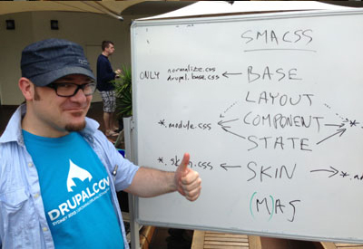

## Coding standards

There are coding standards for **css**, **javascript** and the new **Twig** template engine:

- [CSS Coding standards](https://www.drupal.org/node/1886770).
- [Javascript Coding standards](https://www.drupal.org/node/172169).
- [Twig Coding standards](https://www.drupal.org/node/1823416).

## CSS

The CSS coding standards are based upon two very popular methodologies called SMACSS and BEM. They are also based on the **DRY** principle: **Don't Repeat Yourself**.

### SMACSS

SMACSS (pronounced “smacks”) stands for **Scalable and Modular Architecture for CSS**. Drupal 8 uses **SMACSS** to conceptually categorize CSS rules inside libarries.

#### Base

> **Base** usually contains a [css reset](http://cssreset.com/scripts/eric-meyer-reset-css/) or a [normalize](http://cssreset.com/scripts/normalize-css/), and HTML element styling. Drupal 8 ships with **normalize.css** inside the *system* module.

#### Layout

> **Layout** rules define the composition of common primary modules that typically appear on every page. CSS from **Grid systems** is also categorized here.

#### Component

The official **SMACSS** terminology for this is *modules*. Since *modules* have a different meaning in Drupal, this category was renamed to *component* to avoid confusion.

> **Components** are discrete and reusable elements of the UI. Component rules should be reusable and flexible. Examples of components are carousels, dialogs, widgets, …

#### State

> A **state** is something that augments and overrides all other styles. Typically they describe a certain action or trigger. The best example is the `is-active` state, used to mark an item as *active*. These classes typically start with the `is-` prefix.

#### Theme

Sometimes also called **skin**, again to avoid the confusion with the Drupal term *themes*.

> A **theme** defines colors and/or images to give a certain look and feel to any of the previous element.

    // component.css
    .component {
        border: 1px solid;
    }

    // theme.css
    .component {
        border-color: blue;
    }

More information about SMACSS can be found on the [SMACSS](https://smacss.com/) website.

#### SMACSS for Seven

The Seven theme uses these categories to split up the css rules. The Seven theme contains a directory called `css`. Inside this folder, four more directories live:

- `core/themes/seven/base`
- `core/themes/seven/components`
- `core/themes/seven/layout`
- `core/themes/seven/theme`

These folder contain the stylesheet (`.css` files) for each corresponding category.

[Read more](https://www.drupal.org/node/2321505) about splitting up `style.css` into SMACSS categories.

### BEM

BEM (Block Element Modifier) is a naming convention. The Drupal 8 CSS class names are based on the BEM methodology, resulting in more transparency and meaning.

`.block__element--modifier`

- A **block** is an independent entity with its own meaning that represents a piece of interface on a page.
- An **element** is a part of a block, tied to it semantically and functionally. It has no meaning outside of the block it belongs to. Not all blocks have elements.
- **Modifiers** are flags set on blocks or elements; they define properties or states. They may be boolean (for example, visible: true or false) or key-value pairs (size: large, medium, small) — somewhat similar to HTML attributes, but not exactly the same. Multiple modifiers are allowed on a single item if they represent different properties.

Source: [Smashing Magazine](http://www.smashingmagazine.com/2014/07/17/bem-methodology-for-small-projects/)

`buttons.theme.css (Seven)`:

- `.button {}`, a **block**.
- `.button--primary {}`, a **modifier**.

`node.css (Seven)`:

- `.node__submitted {}`, an **element**.

***

**Read more**

* [Organize Your Styles - An Introduction to SMACSS](https://www.acquia.com/blog/organize-your-styles-introduction-smacss), a blog post by Acquia.
* [BEM and SMACSS: Advice From Developers Who’ve Been There](http://www.sitepoint.com/bem-smacss-advice-from-developers/), a blog post by New Relic.
