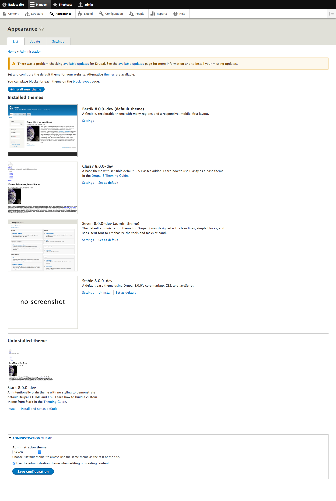
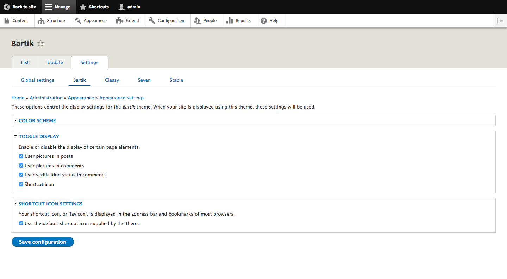

# Theme administration

All - or most of the - theme related settings, are located in the admin's **Appearance** section.

From this page, it's possible to enable and disable themes. Site builders can even install themes using a URL or by uploading a theme archive (*tar tgz gz bz2 zip*). From this page, a theme can be set as default user-facing theme using the **Set as default** button which appears right from the screenshot (this button won't appear for the theme that is currently set as the default theme).

A theme that is installed won't - by default - appear in the front-end, unless it's set as the **default theme**.

At the bottom of the page, the administration theme can be switched.

## Theme settings

Below is an example of Bartik's theme settings page.

## Installing a new theme

Drupal scans the `themes` directory and looks `*.info.yml` to find new themes. Make sure to install themes in the correct directories.

    /themes

> For themes that should be available to all sites.

    /sites/{site}/themes

> For themes that should be available on a specific site (on a multisite installation).
